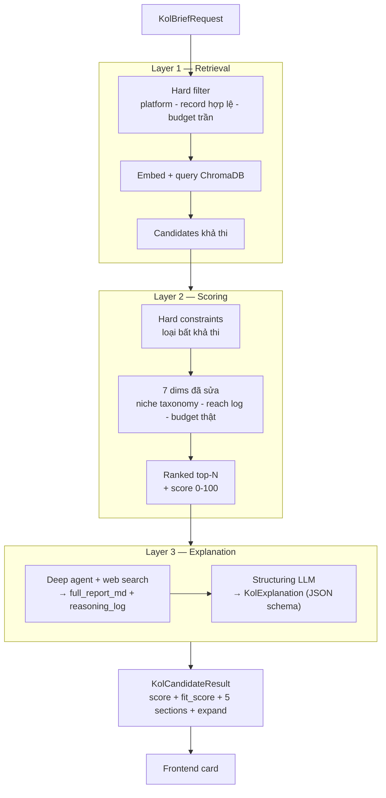
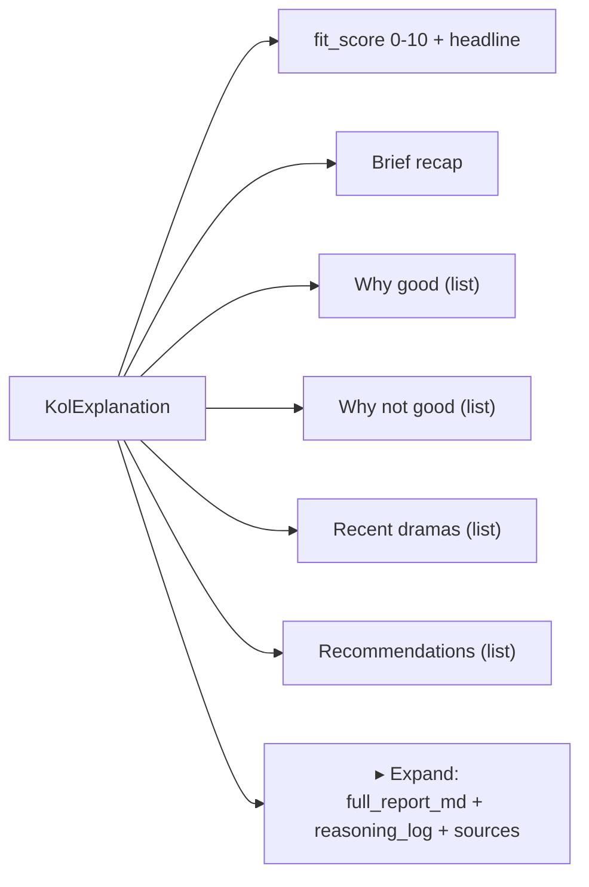
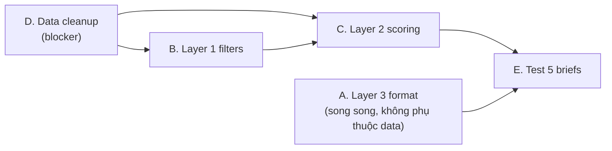

# Backend Requirements — Matching Engine v2 (KOL track)

> **Người nhận:** Backend dev (Đức / Mạnh)
> **Người viết:** Trung
> **Ngày:** 11/06/2026 · Deadline tham chiếu: trước pitch (~2 tuần)
> **Phạm vi:** (A) Đổi Layer 3 sang output có cấu trúc khớp frontend · (B) Sửa Layer 1 retrieval · (C) Sửa Layer 2 scoring · (D) Cleanup data (blocker)
> **File liên quan:** `backend/retrieval_kol.py`, `backend/scoring_kol.py`, `backend/explanation_kol.py`, `backend/models.py`, `backend/main.py`, `backend/ingest_kols.py`, `data/kols_mockup.json`
> **Frontend liên quan:** `frontend/src/lib/data/types.ts`, `frontend/src/components/match-engine/KolCandidateCard.tsx`

---

## 0. Vấn đề hiện tại (vì sao cần v2)

**Layer 3 output là 1 khối markdown tự do, dài, khó scan và khó align với UI.** Ví dụ thực tế hiện tại trả về ~250 chữ văn xuôi lẫn lộn kết luận, lý do, rủi ro, khuyến nghị trong cùng một block. Frontend (`KolCandidateCard`) chỉ render markdown thô → không tách được "Why good / Why not / Dramas / Recommendations", không có nút expand xem full report.

**Layer 1 & 2 cho shortlist chưa hợp lý.** Bằng chứng từ chính `data/kols_mockup.json` (53 KOL):

| Vấn đề | Bằng chứng trong data | Hệ quả |
|---|---|---|
| `booking_fee_estimate` rác | median **2.900 VND** (~$0.12), min 0, max 2 tỷ | `_budget_fit_score` chia 25.000 → hầu hết ra ~$0 → **budget_fit = 1.0 cho gần như mọi KOL** → signal vô nghĩa |
| Record rỗng | `total_followers` min = **0**, `avg_engagement_rate` min = **0.00** | KOL "ma" vẫn lọt retrieval và được chấm điểm |
| Niche phân mảnh | Beauty / Skincare / Wellness / Fashion / Workwear tách rời | `_niche_score` so khớp **exact string** → Skincare vs Beauty = 0.2 dù gần nhau → loại oan |
| `availability` không có | `data` không có field availability | `_availability_score` **hard-code 1.0** → 5 điểm free cho tất cả → nhiễu, không phân biệt |
| Không có hard filter | — | KOL **sai platform** hoặc **vượt xa ngân sách** vẫn lọt vào top nếu niche/engagement cao |
| Reach tuyến tính | followers / 10M | KOL 64M follower luôn cap 1.0 → thiên vị mega-KOL dù không precision-fit |

→ Kết quả: điểm bị nén, shortlist không "biết loại ai", và Layer 3 phải gánh việc giải thích cho một ranking yếu.

**Mục tiêu v2:** shortlist *thật sự lọc được*, và mỗi ứng viên có một thẻ kết quả **scan trong 5 giây** + xem sâu được khi cần.

---

## A. Layer 3 — Output có cấu trúc (ưu tiên cao nhất, align frontend)

### A.1 Format hiển thị mong muốn (theo yêu cầu)

Mỗi ứng viên hiển thị gọn theo block cố định:

```
┌──────────────────────────────────────────────┐
│  #1  Lifestyle by Lauren        Fit: 6/10 🟡  │
│  "Fit nền tảng & engagement, lệch demographic" │
│                                                │
│  📋 Brief        Diana · feminine care · 18-24 │
│  ✅ Why good     • TikTok + unboxing phù hợp   │
│                  • Engagement 8.45% rất cao    │
│  ⚠️ Why not      • Audience 25-34 vs cần 18-24 │
│                  • Niche Lifestyle chưa đủ sát │
│  🔥 Recent dramas • Không phát hiện red flag    │
│  💡 Recommendations • Dùng cho awareness,       │
│                       không cho conversion      │
│                                                │
│  ▸ Xem full report & reasoning  (expand)       │
└──────────────────────────────────────────────┘
```

5 section bắt buộc: **Brief · Why good · Why not good · Recent dramas · Recommendations** + **fit_score** (0–10) + một câu tóm tắt. Phần expand hiện **full report** (văn bản dài như hiện nay) và **reasoning/process** (agent đã search gì, đọc nguồn nào).

### A.2 Thay đổi data model (`backend/models.py`)

Thay field `explanation: str` trong `KolCandidateResult` bằng object có cấu trúc:

```python
class Source(BaseModel):
    title: str
    url: str

class KolExplanation(BaseModel):
    fit_score: float                 # 0–10, do LLM chấm (khác với score 0–100 của Layer 2)
    fit_label: str                   # "Strong fit" | "Partial fit" | "Weak fit"
    headline: str                    # 1 câu tóm tắt (vd. "Fit nền tảng nhưng lệch demographic")
    brief_recap: str                 # nhắc lại brief 1 dòng để có ngữ cảnh
    why_good: list[str]              # 2–5 gạch đầu dòng, mỗi dòng ≤ 1 câu
    why_not_good: list[str]          # 2–5 gạch đầu dòng
    recent_dramas: list[str]         # [] nếu không có; nếu rỗng FE hiện "Không phát hiện red flag"
    recommendations: list[str]       # 1–3 hành động cụ thể
    full_report_md: str              # báo cáo dài dạng markdown (để expand)
    reasoning_log: str               # log quá trình agent: query đã search + nguồn (để expand)
    sources: list[Source] = []       # citation từ web search

class KolCandidateResult(BaseModel):
    rank: int
    kol_id: str
    name: str
    score: float                     # 0–100 từ Layer 2 (giữ nguyên)
    score_breakdown: KolScoreBreakdown
    explanation: KolExplanation      # ← ĐỔI: từ str sang object
    main_niche: str
    primary_platform: str
    platforms: list[str]
    total_followers: int
    avg_engagement_rate: float
    booking_fee: float
```

> **Lưu ý phân biệt 2 loại điểm:** `score` (0–100) = scoring định lượng của Layer 2 (deterministic). `fit_score` (0–10) = đánh giá tổng hợp của LLM sau khi research web (định tính). FE hiển thị cả hai; không gộp.

### A.3 Cách lấy output có cấu trúc đáng tin (`explanation_kol.py`)

Vấn đề: agent hiện trả markdown tự do → parse không ổn định. Hai cách, chọn **cách 2**:

1. ❌ Bắt agent in JSON trực tiếp trong cùng lượt research → dễ vỡ JSON khi agent vừa gọi tool vừa format.
2. ✅ **Tách 2 bước:**
   - **Bước research (giữ như hiện tại):** deep agent + `search_web` tạo ra `full_report_md` (văn bản dài) và ghi lại các tool-call vào `reasoning_log`.
   - **Bước structuring (mới):** gọi LLM lần 2 với **structured output / JSON schema** (Pydantic) để ép `full_report_md` → `KolExplanation`. Dùng `with_structured_output(KolExplanation)` của LangChain hoặc function-calling. Bước này không cần web, nhanh, rẻ, và parse an toàn.

**Thu `reasoning_log`:** deepagents trả về `response["messages"]` gồm các bước trung gian (AIMessage có tool_calls, ToolMessage chứa kết quả search). Duyệt list này, với mỗi tool-call ghi dòng dạng `🔍 query="..." → <n> kết quả`, nối lại thành `reasoning_log`. `sources` lấy từ URL trong ToolMessage.

**Prompt cho bước structuring** (gợi ý, output tiếng Việt):

```
Bạn nhận một báo cáo phân tích độ phù hợp của một KOL với campaign.
Trích xuất thành cấu trúc sau, ngắn gọn, mỗi bullet ≤ 1 câu, tiếng Việt:
- fit_score (0-10) và fit_label (Strong/Partial/Weak fit)
- headline: 1 câu chốt
- why_good / why_not_good: gạch đầu dòng
- recent_dramas: chỉ ghi rủi ro/scandal CÓ THẬT gắn đúng KOL này; nếu không có để mảng rỗng
- recommendations: hành động cụ thể (awareness vs conversion, platform, tệp...)
Không bịa thông tin ngoài báo cáo.
```

**Quy tắc `recent_dramas` (quan trọng — tránh false positive):** chỉ đưa scandal *gắn đúng KOL đang xét*. Như case thực tế "@LifestyleByLauren" — search ra scandal của các "Lauren" khác → KHÔNG được tính. Prompt phải nhấn điều này; nếu không chắc chắn cùng người → bỏ.

### A.4 Fallback & timeout

- Giữ timeout research 25s. Nếu research timeout/quota: trả `KolExplanation` với `full_report_md` = thông báo lỗi, `fit_score` = null/giá trị từ Layer 2 quy đổi (score/10), các list rỗng, `headline` = "AI explanation tạm thời không khả dụng — điểm scoring vẫn chính xác." FE vẫn render được block.
- Bước structuring lỗi parse → fallback: nhét toàn bộ text vào `full_report_md`, các field còn lại để mặc định.

### A.5 Thay đổi API contract & frontend

- `KolMatchResponse.shortlist[].explanation` đổi từ `string` → object `KolExplanation`. **Đây là breaking change** → cập nhật đồng thời:
  - `frontend/src/lib/data/types.ts`: thêm interface `KolExplanation`, `Source`; đổi type `explanation` trong `KolCandidateResult`.
  - `frontend/src/components/match-engine/KolCandidateCard.tsx`: thay `renderMarkdown(candidate.explanation)` bằng render 5 section + badge `fit_score` + `<details>`/accordion cho `full_report_md` và `reasoning_log`. (Track Director có thể giữ `explanation: str` cũ, hoặc đồng bộ sau — ghi rõ để FE không nhầm.)
- Giữ nguyên `/match/kol` path và các field khác để giảm vùng ảnh hưởng.

### A.6 Acceptance criteria — Layer 3

- [ ] `POST /match/kol` trả mỗi ứng viên có đủ 5 section + `fit_score` + `headline`, đúng schema Pydantic (validate pass).
- [ ] `recent_dramas` rỗng khi không có rủi ro thật; không dính scandal của người trùng tên.
- [ ] `full_report_md` và `reasoning_log` có nội dung và render được trong phần expand.
- [ ] Khi quota/timeout: vẫn trả object hợp lệ, FE không vỡ.
- [ ] FE hiển thị thẻ scan được trong ~5s, expand xem được chi tiết.

---

## A★. Expose pipeline stages — cho user thấy quá trình multi-stage

> Yêu cầu: lộ danh sách KOL còn lại **sau Layer 1** và **sau Layer 2** (không chỉ shortlist cuối) để user theo dõi engine lọc qua từng lớp. FE dựng "process view" (xem `fe_pipeline_process_mockup.html`).

### A★.1 Thêm vào `KolMatchResponse`

```python
class StageCandidate(BaseModel):
    kol_id: str
    name: str
    status: str              # "passed" | "filtered" | "shortlisted" | "dropped"
    metric: float | None = None   # L1: similarity (cosine) · L2: score 0–100
    rank: int | None = None       # L2: thứ hạng nếu shortlisted
    reason: str | None = None     # lý do filter/drop (vd. "sai platform", "vượt ngân sách")

class PipelineStage(BaseModel):
    id: str                  # "retrieval" | "scoring" | "explanation"
    layer: int               # 1 | 2 | 3
    name: str                # "Semantic Retrieval" ...
    method: str              # "ChromaDB + all-MiniLM-L6-v2" ...
    in_count: int            # số ứng viên đầu vào (corpus / stage trước)
    out_count: int           # số ứng viên đi tiếp
    agentic: bool = False    # True cho Layer 3
    candidates: list[StageCandidate]

class KolMatchResponse(BaseModel):
    brief_summary: str
    shortlist: list[KolCandidateResult]
    pipeline: list[PipelineStage]      # ← THÊM
    total_candidates_considered: int
    response_time_ms: int
```

### A★.2 Việc cần làm ở backend

- **Layer 1 (`retrieval_kol.py`):** trả thêm `similarity` (đổi từ ChromaDB `distance` → `1 - distance` hoặc chuẩn hóa) cho mỗi candidate; ghi lại các KOL bị **hard filter** loại (platform/record) kèm `reason`. Gom thành `PipelineStage(id="retrieval")`.
- **Layer 2 (`scoring_kol.py`):** hiện đang `slice top_n` rồi vứt phần còn lại. Cần **giữ toàn bộ candidate đã chấm**, đánh dấu top-N là `shortlisted` (kèm `rank`), phần còn lại `dropped`; những ai rớt **hard constraint** ghi `reason` (vd. "vượt ngân sách 3×", "audience lệch"). Gom thành `PipelineStage(id="scoring")`.
- **Layer 3:** `PipelineStage(id="explanation", agentic=True)` — danh sách shortlist + `fit_score` (lấy sau khi explanation chạy).
- `main.py` lắp 3 stage vào response.

### A★.3 Lưu ý
- **Giới hạn payload:** Layer 1 có thể lọc hàng nghìn KOL — KHÔNG trả hết. Trả top ~20 `passed` + một mẫu đại diện các `filtered` (kèm tổng số bị loại), không trả toàn bộ corpus.
- Trường `reason` nên là enum/khóa ngắn (FE map sang nhãn tiếng Việt) để nhất quán: `wrong_platform`, `empty_record`, `over_budget`, `audience_mismatch`, `low_score`.

### A★.4 Acceptance criteria
- [ ] Response có `pipeline` với 3 stage, `in_count`/`out_count` khớp thực tế.
- [ ] Layer 1 stage liệt kê được candidate giữ lại (có similarity) + mẫu bị loại có `reason`.
- [ ] Layer 2 stage phân biệt rõ `shortlisted` (rank) vs `dropped` (reason).
- [ ] Payload không phình to bất thường khi corpus lớn.

---

## B. Layer 1 — Retrieval (`retrieval_kol.py`, `ingest_kols.py`)

Mục tiêu: chỉ đưa vào Layer 2 những ứng viên **khả thi**, không phải "top-20 bất kể".

### B.1 Hard filters trước/khi query (loại cứng, không phải trừ điểm)

Dùng `where` clause của ChromaDB để lọc metadata *trước* khi tính khoảng cách semantic:

- **Platform:** nếu campaign là TikTok Shop → KOL phải có platform đó trong `platforms`. KOL không có platform yêu cầu → loại.
- **Record hợp lệ:** loại KOL có `total_followers <= 0` hoặc `avg_engagement_rate <= 0` (data rác — xem mục D).
- **(Tùy chọn) Budget trần cứng:** loại KOL có fee thật (sau khi data sạch) > ngưỡng bội số ngân sách (vd. > 3× budget) — đưa về Layer 2 nếu muốn mềm hơn.

> ChromaDB `platforms` đang lưu dạng string nối `"YOUTUBE,INSTAGRAM"`. Để filter chuẩn, ingest nên lưu thêm field boolean/array thân thiện filter (vd. `on_tiktok: true`) vì ChromaDB `where` không match substring tốt.

### B.2 Cải thiện chất lượng retrieval

- **Tăng `top_k` tương đối với corpus nhỏ:** 53 KOL mà lấy 20 thì retrieval gần như không lọc. Khi data còn nhỏ, có thể để Layer 2 chấm nhiều hơn (top_k=30) rồi Layer 2 + filter mới là bộ lọc chính. Khi scale lên hàng nghìn, giữ top_k=50–100 rồi rerank.
- **(Khuyến nghị, không bắt buộc cho pitch) Embedding model mạnh hơn:** `all-MiniLM-L6-v2` yếu, đặc biệt tiếng Việt. Cân nhắc `bge-m3` hoặc `multilingual-e5-base`. Phải re-ingest nếu đổi model.
- **(Giai đoạn sau) Hybrid retrieval:** dense (embedding) + sparse (BM25 trên niche/bio/keyword) rồi Reciprocal Rank Fusion. Brief hay chứa keyword cứng (tên niche/sản phẩm) embedding dễ miss.

### B.3 Acceptance criteria — Layer 1

- [ ] Campaign TikTok → không ứng viên nào trong shortlist thiếu TikTok.
- [ ] Không còn KOL `followers=0` / `engagement=0` lọt vào kết quả.
- [ ] Retrieval trả về tập ứng viên *khả thi*, log rõ số bị filter cứng.

---

## C. Layer 2 — Scoring (`scoring_kol.py`)

Sửa từng dimension cho phản ánh thực tế + thêm **hard constraint** để loại ứng viên bất khả thi thay vì chỉ trừ điểm.

### C.1 Sửa từng dimension

| Dimension | Hiện tại | Vấn đề | Đề xuất v2 |
|---|---|---|---|
| `niche_match` (25%) | exact match → 1.0, else 0.2 | quá nhị phân; Skincare≠Beauty | **Taxonomy/semantic:** map niche về nhóm (Beauty⊇{Beauty,Skincare,Makeup,Wellness}; Fashion⊇{Fashion,Workwear}). Exact=1.0, cùng nhóm=0.6, semantic-gần=0.4 (cosine giữa embedding niche), khác hẳn=0.1 |
| `platform_match` (20%) | exact 1.0 / in list 0.6 / else 0.1 | OK nhưng platform nên là **hard filter** ở L1 | Sau khi L1 đã lọc platform: exact primary=1.0, có trong list=0.7 |
| `audience_fit` (20%) | overlap age range | OK nhưng `0.5` khi thiếu data quá hào phóng | giữ overlap; thiếu data → 0.3 (phạt nhẹ vì thiếu tin) |
| `engagement` (15%) | rate / 10.0 | cap 10% cứng; data có rate=0 và 12.5 (nghi ngờ) | **percentile-based** trong corpus (rank trong tập) hoặc cap = p90 thực tế. Cảnh báo: engagement thường nghịch với follower — đừng để mega-KOL ăn cả 2 |
| `reach` (10%) | followers / 10M (tuyến tính) | thiên vị mega-KOL | **log scale**: `log10(followers+1)/log10(CAP+1)`. Diminishing returns hợp lý hơn |
| `budget_fit` (5%) | fee/25000 ≤ budget | data fee rác → luôn 1.0 | **Phụ thuộc data sạch (mục D).** Trong khoảng → 1.0; vượt → giảm dần theo % vượt; **vượt > X% → đề xuất thành hard constraint loại** |
| `availability` (5%) | hard-code 1.0 | điểm free, vô nghĩa | **Bỏ dimension này** (tái phân bổ 5% sang niche hoặc commerce signal) **HOẶC** thêm field availability thật vào data. Không giữ điểm giả |

### C.2 Hard constraints (loại, không trừ điểm)

Một số tiêu chí nên loại thẳng vì shortlist không nên chứa ứng viên bất khả thi:

- Sai platform bắt buộc (đã ở L1).
- Fee vượt ngân sách quá ngưỡng (vd. > 2–3× budget) — dù niche hoàn hảo cũng không khả thi.
- Audience lệch hoàn toàn (không giao nhau chút nào) với sản phẩm nhạy cảm (feminine care, baby...) → cân nhắc loại hoặc flag mạnh.

Đề xuất: trả về 2 nhóm — `shortlist` (qua hết hard constraint) và (tùy chọn) `near_miss` (fail 1 constraint, để business tham khảo). Hoặc tối thiểu: log lý do loại.

### C.3 Chống nén điểm (shortlist phải "biết loại ai")

- Sau khi tính, kiểm tra độ phân tán điểm. Nếu top-5 chênh < 5 điểm → tín hiệu các dimension không phân biệt được → review trọng số.
- Cân nhắc thêm **commerce signal** (theo roadmap TikTok Shop): category-fit, và sau này GMV/conversion. Ở v2 tối thiểu thêm `category_fit` đơn giản nếu data cho phép.

### C.4 Acceptance criteria — Layer 2

- [ ] Trên 5 brief test (mục E), top-5 *hợp lý với người đọc* và **không chứa** ứng viên sai platform / vượt ngân sách / followers=0.
- [ ] `availability` không còn cho điểm giả.
- [ ] Niche gần nhau (Skincare↔Beauty) không bị loại oan.
- [ ] Điểm top-5 có độ phân tán hợp lý (không nén sát nhau).

---

## D. Data cleanup (BLOCKER — phải làm trước C)

Scoring không thể đúng khi data sai. Cần trước khi tinh chỉnh trọng số:

- **`booking_fee_estimate`:** dữ liệu rác (median 2.900 VND, min 0, max 2 tỷ). Chuẩn hóa lại đơn vị VND hợp lý theo tier follower, hoặc đánh dấu `fee_unknown=true` để scoring xử lý riêng. Xác nhận đơn vị (VND hay nghìn VND?).
- **Record rỗng:** loại/sửa KOL `total_followers=0`, `avg_engagement_rate=0`.
- **Niche taxonomy:** chuẩn hóa danh sách niche + bảng map nhóm (dùng cho C.1).
- **Thiếu `availability`:** quyết định thêm field thật hay bỏ dimension (C.1).
- **Bối cảnh TikTok Shop US:** data hiện là KOL Việt Nam (bio tiếng Việt, fee VND). Theo roadmap pitch, cần thay/bổ sung mẫu creator TikTok Shop US — tối thiểu một tập nhỏ thật để demo đúng bài toán. (Việc này phối hợp với Sơn/Đức về nguồn data.)

---

## E. Test cases cho dev (dùng nghiệm thu)

Tạo `backend/test_briefs_kol.json` gồm tối thiểu 5 brief, mỗi brief kèm kỳ vọng:

1. **Feminine care (Diana), 18–24, TikTok, $50K** → top phải là KOL TikTok, audience 18–24, niche Beauty/Wellness; KOL audience 25–34 bị xuống hạng; không ai sai platform.
2. **Gaming, 18–24, YouTube, ngân sách nhỏ** → KOL Gaming/YouTube lên top; mega-KOL fee cao bị loại bởi hard constraint budget.
3. **Food/F&B, 25–34, Instagram** → kiểm tra niche taxonomy (Food) + platform.
4. **Tech, 25–44, đa nền tảng, ngân sách lớn** → kiểm reach log-scale không để 1 mega-KOL nuốt hết.
5. **Brief niche hiếm (Pet/Baby & Kids)** → kiểm hành vi khi ít ứng viên: shortlist ngắn hơn còn hơn nhồi ứng viên sai.

Mỗi case: assert (a) không vi phạm hard constraint, (b) top-1 thuộc nhóm niche kỳ vọng, (c) explanation đủ 5 section.

---

## F. Sơ đồ pipeline v2

### F.1 Luồng tổng thể (đã có hard filter + structuring step)



### F.2 Cấu trúc một thẻ kết quả (Layer 3 output)



---

## G. Thứ tự thực hiện đề xuất



1. **A — Layer 3 format** có thể làm song song ngay (không phụ thuộc data).
2. **D — Data cleanup** là blocker cho B & C.
3. **B → C** sau khi data sạch.
4. **E — Test** nghiệm thu cuối.

> Cập nhật `models.py` là **breaking change** → thông báo cả team (FE) trước khi merge, theo quy ước "API contract là ground truth".
