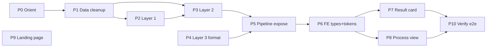

# Plan prompt cho Claude Code — Matching Engine v2 + FE + Landing

> **Mục đích:** chuỗi prompt copy-paste vào Claude Code để hiện thực hoá toàn bộ v2. Mỗi prompt là một đơn vị công việc (1 branch / 1 PR), có context + acceptance criteria.
> **Cách dùng:** mở Claude Code tại repo `content-matching-ventureX2026`, chạy **Prompt 0** trước (để nó đọc spec), rồi chạy từng prompt theo thứ tự. Không gộp tất cả vào một lần — chạy tuần tự, review & commit sau mỗi prompt.
> **Spec nguồn (Claude Code phải đọc):**
> - `docs/BACKEND_REQUIREMENTS_matching_v2.md` — contract backend (L1/L2/L3 + pipeline)
> - `docs/FE_DESIGN_kol_result_and_landing.md` — design FE + ref pull
> - Mockup HTML đối chiếu: `docs/fe_kol_result_mockup.html`, `docs/fe_pipeline_process_mockup.html`, `docs/fe_landing_tiktokshop_mockup.html`

## Thứ tự dependency



> P4 (Layer 3) và P9 (Landing) không phụ thuộc data → có thể làm song song. Backend (P1–P5) nên xong trước FE phần data (P6–P8). Landing P9 độc lập hoàn toàn.

---

## Quy ước chung (nhắc Claude Code mỗi prompt)

- Stack: backend FastAPI + ChromaDB + sentence-transformers; FE Next.js App Router + Tailwind v4 + shadcn/ui.
- **Không phá track Director** đang chạy. Thay đổi `models.py`/`types.ts` là breaking change → giữ tương thích hoặc cập nhật đồng bộ.
- Mỗi task: tạo branch riêng, chạy test, commit message rõ ràng (theo style repo: `feat(layer2): ...`).
- Đối chiếu pixel với file mockup HTML tương ứng; bản thật build bằng component shadcn, không copy HTML thô.

---

## Prompt 0 — Orient (chạy đầu tiên)

```text
Đọc các file sau trong repo rồi tóm tắt lại cho tôi bằng 10–15 dòng kế hoạch hiện thực hoá:
- docs/BACKEND_REQUIREMENTS_matching_v2.md
- docs/FE_DESIGN_kol_result_and_landing.md
- backend/models.py, backend/main.py, backend/retrieval_kol.py, backend/scoring_kol.py, backend/explanation_kol.py, backend/ingest_kols.py
- frontend/src/lib/data/types.ts, frontend/src/components/match-engine/KolCandidateCard.tsx
- data/kols_mockup.json (xem schema + chất lượng dữ liệu)

Mục tiêu tổng thể: nâng matching engine track KOL lên v2 — Layer 3 trả output có cấu trúc (Brief/Why good/Why not/Recent dramas/Recommendations + fit_score + full report), sửa Layer 1+2 cho shortlist hợp lý, expose pipeline từng stage, và làm lại FE (result card + process view + landing page theme TikTok Shop).

CHƯA code gì cả. Chỉ xác nhận bạn hiểu kiến trúc, liệt kê rủi ro/điểm cần làm rõ, và đề xuất thứ tự branch.
```

---

## Prompt 1 — Data cleanup (BLOCKER)

```text
Theo docs/BACKEND_REQUIREMENTS_matching_v2.md mục D. Branch: backend/data-cleanup-v2.

Sửa data/kols_mockup.json + backend/ingest_kols.py:
1. booking_fee_estimate: dữ liệu rác (median ~2.900 VND, min 0, max 2 tỷ). Chuẩn hoá lại theo tier follower cho hợp lý (VND), hoặc thêm cờ fee_unknown=true cho record không xác định.
2. Loại/sửa record rỗng: total_followers<=0 hoặc avg_engagement_rate<=0.
3. Tạo bảng niche taxonomy (file backend/niche_taxonomy.py hoặc json): map các niche con về nhóm (vd Beauty ⊇ {Beauty, Skincare, Makeup, Wellness}; Fashion ⊇ {Fashion, Workwear}).
4. Quyết định field availability: hoặc thêm dữ liệu thật vào mỗi KOL, hoặc đánh dấu để Layer 2 bỏ dimension (xem mục C.1) — chọn 1 và ghi chú lý do.
5. Trong ingest_kols.py: thêm field thân thiện filter cho platform (vd on_tiktok/on_youtube boolean hoặc list chuẩn hoá) để ChromaDB where filter chạy được.

Viết 1 script kiểm tra phân bố sau cleanup (in min/max/median fee, followers, engagement; đếm theo niche/platform). Chạy lại ingest. Acceptance: không còn record rỗng; fee có đơn vị hợp lý; có taxonomy dùng được ở Layer 2.
```

---

## Prompt 2 — Layer 1 retrieval (hard filters + similarity)

```text
Theo docs/BACKEND_REQUIREMENTS_matching_v2.md mục B. Branch: backend/layer1-v2. Phụ thuộc P1.

Sửa backend/retrieval_kol.py:
1. Hard filter TRƯỚC khi tính semantic: dùng ChromaDB where clause loại KOL sai platform yêu cầu (vd campaign TikTok Shop → phải có TikTok), loại record không hợp lệ.
2. Trả thêm similarity cho mỗi candidate (chuẩn hoá 1 - distance), giữ lại danh sách bị filter kèm reason (enum: wrong_platform, empty_record, over_budget).
3. Tăng top_k hợp lý với corpus hiện tại; log số bị filter cứng.

Acceptance: campaign TikTok → không ứng viên nào thiếu TikTok; không còn followers=0/engagement=0; hàm trả về (passed_candidates_with_similarity, filtered_with_reason). Viết/cập nhật test trong backend/test_retrieval.py.
```

---

## Prompt 3 — Layer 2 scoring (sửa dimension + hard constraints)

```text
Theo docs/BACKEND_REQUIREMENTS_matching_v2.md mục C. Branch: backend/layer2-v2. Phụ thuộc P1, P2.

Sửa backend/scoring_kol.py:
1. niche_match: dùng niche taxonomy (P1) — exact=1.0, cùng nhóm=0.6, khác hẳn=0.1 (thay binary 1.0/0.2).
2. reach: đổi sang log scale log10(followers+1)/log10(CAP+1).
3. engagement: percentile-based theo corpus (hoặc cap = p90 thực tế) thay vì /10 cứng.
4. budget_fit: dùng fee đã cleanup; trong khoảng=1.0, vượt giảm dần theo % vượt.
5. availability: bỏ dimension giả (tái phân bổ 5% sang niche/commerce) HOẶC dùng data thật theo quyết định ở P1.
6. Hard constraints: loại thẳng ứng viên vượt ngân sách quá ngưỡng (vd >2–3×) hoặc audience lệch hoàn toàn — KHÔNG chỉ trừ điểm. Giữ lại reason cho mỗi candidate bị loại (over_budget, audience_mismatch, low_score).
7. GIỮ toàn bộ candidate đã chấm (không vứt phần ngoài top_n) — đánh dấu shortlisted (kèm rank) vs dropped (kèm reason). Cần cho P5.

Acceptance: top-5 không chứa ứng viên sai platform/vượt ngân sách; niche gần nhau không bị loại oan; điểm top-5 phân tán hợp lý. Cập nhật backend/test_scoring.py với 2–3 case.
```

---

## Prompt 4 — Layer 3 structured output (song song được)

```text
Theo docs/BACKEND_REQUIREMENTS_matching_v2.md mục A. Branch: backend/layer3-structured.

1. backend/models.py: thêm Source, KolExplanation (fit_score, fit_label, headline, brief_recap, why_good[], why_not_good[], recent_dramas[], recommendations[], full_report_md, reasoning_log, sources[]); đổi KolCandidateResult.explanation: str -> KolExplanation.
2. backend/explanation_kol.py: GIỮ bước deep agent + web search tạo full_report_md; thu reasoning_log từ response["messages"] (tool calls + kết quả) và sources từ URL trong ToolMessage. THÊM bước structuring thứ 2 dùng LLM with_structured_output(KolExplanation) ép report -> JSON an toàn (langchain). Prompt structuring: output tiếng Việt, mỗi bullet ≤1 câu, recent_dramas chỉ ghi scandal gắn ĐÚNG KOL (case trùng tên Lauren → bỏ).
3. Fallback: timeout/quota → trả KolExplanation hợp lệ (full_report_md=thông báo, list rỗng, headline thông báo), KHÔNG vỡ schema.
4. backend/main.py: cập nhật endpoint /match/kol build KolExplanation.

Acceptance: /match/kol trả mỗi ứng viên đủ 5 section + fit_score, validate Pydantic pass; recent_dramas rỗng khi không có rủi ro thật; reasoning_log có nội dung.
```

---

## Prompt 5 — Expose pipeline stages

```text
Theo docs/BACKEND_REQUIREMENTS_matching_v2.md mục A★. Branch: backend/pipeline-expose. Phụ thuộc P2, P3, P4.

1. models.py: thêm StageCandidate, PipelineStage; thêm pipeline: list[PipelineStage] vào KolMatchResponse.
2. main.py /match/kol: lắp 3 stage:
   - retrieval (layer1): passed (kèm similarity) + mẫu filtered (kèm reason); in_count=corpus, out_count.
   - scoring (layer2): shortlisted (rank) + dropped (reason).
   - explanation (layer3, agentic=true): shortlist + fit_score.
3. Giới hạn payload: Layer 1 chỉ trả top ~20 passed + mẫu filtered + tổng số bị loại, KHÔNG trả cả corpus. reason là enum ngắn.

Acceptance: response có pipeline 3 stage, in/out_count khớp; phân biệt passed/filtered/shortlisted/dropped; payload không phình to.
```

---

## Prompt 6 — FE types + semantic tokens

```text
Theo docs/FE_DESIGN_kol_result_and_landing.md mục 2,3,6★. Branch: frontend/types-tokens-v2. Phụ thuộc P4, P5 (contract).

1. frontend/src/lib/data/types.ts: thêm interface Source, KolExplanation, StageCandidate, PipelineStage; đổi explanation trong KolCandidateResult sang KolExplanation; thêm pipeline vào KolMatchResponse. Đồng bộ ĐÚNG với backend models.py.
2. frontend/src/app/globals.css: thêm semantic tokens --good/--warn/--risk/--info (+ -bg/-border) cho cả :root và .dark (xem mục 3).
3. Cài primitives còn thiếu: npx shadcn@latest add accordion progress tabs hover-card chart collapsible.

Acceptance: type-check pass; tokens dùng được ở light/dark.
```

---

## Prompt 7 — FE result card v2

```text
Theo docs/FE_DESIGN_kol_result_and_landing.md mục 2 + đối chiếu docs/fe_kol_result_mockup.html. Branch: frontend/result-card-v2. Phụ thuộc P6.

Refactor frontend/src/components/match-engine/KolCandidateCard.tsx:
1. Verdict banner: fit score ring 0–10 (SVG stroke-dashoffset hoặc recharts radial) + badge fit_label màu theo tier (>=7 good, 4–6.9 warn, <4 risk) + headline.
2. Identity (avatar + tên + niche/platform chips) + stat pills (followers, engagement, fee).
3. Hai cột Why good / Why not good (semantic màu, icon ✓ / !).
4. Risk row: recent_dramas — rỗng = "Không phát hiện red flag" (xanh), có = đỏ kèm nội dung.
5. Recommendations callout (info).
6. Score breakdown 7 bar (giữ như cũ).
7. Expand bằng Accordion: full_report_md (render markdown), reasoning_log (terminal style), sources (links).
Accessibility: không chỉ dựa màu (icon+chữ), aria-label cho ring, focus-visible, prefers-reduced-motion. Mọi số làm tròn.

Acceptance: render khớp mockup; states loading/timeout/empty xử lý đúng; mobile 2 cột → 1 cột.
```

---

## Prompt 8 — FE process view (pipeline)

```text
Theo docs/FE_DESIGN_kol_result_and_landing.md mục 6★ + đối chiếu docs/fe_pipeline_process_mockup.html. Branch: frontend/process-view. Phụ thuộc P6.

Tạo component ProcessView đọc pipeline[] từ response:
1. Funnel band 3 metric card (Layer 1/2/3) với in_count→out_count, màu riêng từng layer.
2. 3 cột candidate: passed (similarity) / filtered (reason), shortlisted (rank) / dropped (reason) — row chip, dropped = viền đứt + gạch tên + badge reason.
3. Layer 3 = agent cards với query-log terminal + fit.
4. Animation stagger khi load (bọc prefers-reduced-motion). Map reason enum -> nhãn VN.
Tích hợp vào trang kết quả: shadcn Tabs "Kết quả | Quá trình" (frontend/src/app/kols/engine/page.tsx).

Acceptance: hiển thị đúng candidate từng stage + lý do loại; khớp mockup; có nhãn VN cho reason.
```

---

## Prompt 9 — Landing page (theme TikTok Shop, độc lập)

```text
Theo docs/FE_DESIGN_kol_result_and_landing.md mục 7 + đối chiếu docs/fe_landing_tiktokshop_mockup.html. Branch: frontend/landing.

Build landing page (route mới app/(marketing)/page.tsx hoặc /landing) theo công thức Linear nhưng theme TikTok Shop:
- Nền đen #08090a, accent cyan #25F4EE + đỏ-hồng #FE2C55, glow tiết chế, typography mạnh (Inter), motion vừa phải (scroll-reveal).
- Hero: pill "Powered by Ecomdy · TikTok Shop US" + headline + CTA đỏ + KHUNG BROWSER chứa screenshot sản phẩm thật (result card dark). KHÔNG dùng emoji icon / gradient blob generic.
- Sections: how-it-works 3 layer · bento toàn UI thật (pipeline funnel, chip loại có lý do, terminal agent, bars commerce) · stat band · CTA glow · footer.
- KHÔNG code chay: pull từ Launch UI (launchuicomponents.com — Next15+shadcn+TWv4) hoặc Cruip Open React Template rồi đổi nội dung + recolor sang token TikTok Shop.

Đối chiếu pixel với fe_landing_tiktokshop_mockup.html. Acceptance: responsive, dark, dùng screenshot UI thật, không generic-AI look.
```

---

## Prompt 10 — Verify end-to-end

```text
Branch: chore/verify-v2. Phụ thuộc tất cả.

1. Tạo backend/test_briefs_kol.json gồm 5 brief (mục E của BACKEND_REQUIREMENTS_matching_v2.md). Viết script chạy 5 brief qua /match/kol, assert: không vi phạm hard constraint, top-1 đúng nhóm niche kỳ vọng, explanation đủ 5 section, pipeline có 3 stage.
2. Chạy backend tests + FE type-check + build.
3. Chụp màn hình trang kết quả (card + tab Quá trình) và landing, đối chiếu mockup.
4. Báo cáo: cái gì pass, cái gì lệch so với spec, đề xuất chỉnh.
```

---

## Gợi ý vận hành

- Chạy **P0 → P1 → P2 → P3** (backend core), rồi **P4, P5** (output + pipeline). Sau đó **P6 → P7, P8** (FE). **P9** (landing) làm bất cứ lúc nào. Kết bằng **P10**.
- Sau mỗi prompt: review diff, chạy test, commit, mở PR. Đừng để Claude Code làm liên tục nhiều prompt không review.
- Nếu Claude Code hỏi quyết định (vd đơn vị fee, bỏ hay giữ availability) → trả lời dứt khoát rồi để nó tiếp.
