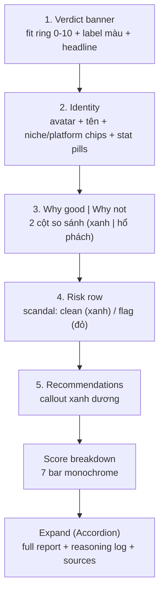
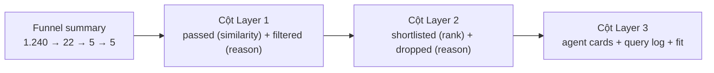
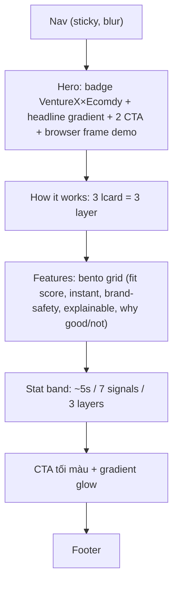

# FE Design Spec — KOL Result Card + Landing Page

> **Người nhận:** Team FE (Duy · Mạnh)
> **Người viết:** Trung · Ngày 11/06/2026
> **Stack hiện tại:** Next.js (App Router) · Tailwind v4 · shadcn/ui · Inter + JetBrains Mono · palette monochrome (oklch)
> **Nguyên tắc cốt lõi:** **KHÔNG code FE từ đầu.** Pull block/template có sẵn (hợp chính xác stack shadcn) rồi đổi nội dung. Mục tiêu: dễ tiếp cận, đẹp, thu hút — nhưng nhanh.
> **Mockup kèm theo (mở bằng browser):** `fe_kol_result_mockup.html` (card kết quả) · `fe_landing_mockup.html` (landing)

---

## 0. Hai deliverable trong spec này

1. **Result card KOL v2** — thẻ kết quả theo format Layer 3 mới (xem `BACKEND_REQUIREMENTS_matching_v2.md`): 5 section **Brief · Why good · Why not good · Recent dramas · Recommendations** + `fit_score` + expand full report/reasoning.
2. **Landing page** marketing cho sản phẩm (phục vụ pitch + giới thiệu Ecomdy).

---

## 1. ⭐ Ref / framework để PULL VỀ (không code chay)

Stack đang là shadcn/ui → ưu tiên nguồn cài bằng CLI `npx shadcn@latest add ...` hoặc copy-paste trực tiếp, **giữ nguyên design tokens hiện có**.

### 1.1 Cho Result Card & Dashboard (app)

| Nguồn | Pull cái gì | Cách lấy | Ghi chú |
|---|---|---|---|
| **shadcn/ui official blocks** (ui.shadcn.com/blocks) | Card, Accordion, Progress, Tabs, Badge, Hover Card, Chart (radial) | `npx shadcn@latest add accordion progress hover-card chart` | Cùng registry, zero-friction. Card kết quả ghép từ đây. |
| **Shadcnblocks** (shadcnblocks.com) | 1.390+ block: stat cards, list, detail panel | copy-paste / registry | Có free + pro. Lấy mẫu "candidate / profile detail". |
| **21st.dev** | Component cộng đồng theo chuẩn shadcn | `npx shadcn add "https://21st.dev/..."` | Tìm "radial progress", "score ring", "comparison". |
| **Cult UI** (cult-ui.com) | UI cho **app AI**: streaming text, chat, model selector | copy-paste, theo chuẩn shadcn | Hợp phần explanation + chọn provider (Google/xAI/OpenAI). |
| **Tremor** (tremor.so) | Charts/KPI cho trang analytics dashboard | npm | Dùng cho `/kols`, `/projects`, ROI nếu muốn nâng cấp chart. |

### 1.2 Cho Landing Page (marketing)

| Nguồn | Pull cái gì | Ghi chú |
|---|---|---|
| **Magic UI** (magicui.design) | Template **Startup** free (12 section: Hero, Features, Bento, Pricing, FAQ) + 150+ animated component | shadcn-compatible. **Đề xuất dùng làm xương sống landing.** |
| **Aceternity UI** (ui.aceternity.com) | Hero motion, 3D card, animated beam/border, bento, marquee | Free components + template premium ($249 all-access). Lấy 1–2 hero/bento cho phần "wow". |
| **shadcn landing templates** | Landing kit dựng sẵn (xem adminlte.io/blog/shadcn-ui-landing-page-templates) | Nếu muốn nguyên trang. |

> **Lưu ý license:** component free copy-paste thoải mái. Template premium (Aceternity all-access $249) chỉ mua nếu cần nhiều — cho pitch thì bản free là đủ.

### 1.3 Quy tắc khi pull

- Giữ nguyên `globals.css` tokens hiện có (monochrome). Block pull về **map màu sang biến `--primary/--muted/--border…`**, không hardcode.
- Landing có thể dùng tông marketing đậm hơn (1 accent tím `oklch(0.55 0.20 264)` = `--chart-1`) + chút gradient/motion — nhưng vẫn Inter để đồng bộ brand.
- Animation: Magic UI / Aceternity dùng `framer-motion` — cài `npm i motion` (framer-motion v12+).

---

## 2. Result Card — cấu trúc & component mapping

Thứ tự từ trên xuống (xem mockup `fe_kol_result_mockup.html`):



| Khối | shadcn/ref dùng | Data field |
|---|---|---|
| Verdict ring | `Chart` radial (recharts `RadialBar`) hoặc SVG `stroke-dashoffset` (như mockup) | `fit_score`, `fit_label` |
| Verdict label | `Badge` (variant theo tier) | `fit_label` → màu |
| Headline | text | `headline` |
| Identity | avatar circle + `Badge` chips | `name`, `main_niche`, `platforms`, `primary_platform` |
| Stat pills | metric mini-card (bg muted) | `total_followers`, `avg_engagement_rate`, `booking_fee` |
| Why good / not | 2 box, border-color semantic | `why_good[]`, `why_not_good[]` |
| Risk row | callout | `recent_dramas[]` (rỗng → "không red flag") |
| Recommendations | callout `info` | `recommendations[]` |
| Score bars | `Progress` hoặc div bar (như `KolCandidateCard` hiện tại) | `score_breakdown` |
| Expand | `Accordion` (`type=single collapsible`) | `full_report_md`, `reasoning_log`, `sources[]` |

### 2.1 Fit tier → màu (semantic, dùng nhất quán)

| `fit_score` | `fit_label` | Màu | Token đề xuất |
|---|---|---|---|
| ≥ 7.0 | Strong fit | xanh lá | `--good` |
| 4.0 – 6.9 | Partial fit | hổ phách | `--warn` |
| < 4.0 | Weak fit | đỏ | `--risk` |

> Hiện `globals.css` chỉ có `--destructive` + chart colors. **Đề xuất thêm semantic tokens** (good/warn/risk/info, mỗi cái có `-bg`/`-border`) như trong mockup, cho cả light & dark. Đây là nâng cấp nhỏ nhưng cần cho tính dễ scan.

---

## 3. Design tokens (giữ + bổ sung)

```css
/* GIỮ NGUYÊN: monochrome base, Inter, radius 0.5rem */
/* BỔ SUNG vào :root và .dark — semantic cho fit/why/risk: */
--good:#2f7d32; --good-bg:#eaf3ea; --good-border:#cfe6cf;   /* dark: nhạt hơn */
--warn:#a3650b; --warn-bg:#fbf2e3; --warn-border:#f0e0c0;
--risk:#b3261e; --risk-bg:#fbeaea; --risk-border:#f0cccc;
--info:#1f5fa5; --info-bg:#e9f1fb; --info-border:#cfe0f5;
```

Nguyên tắc text-trên-nền-màu: dùng shade đậm cùng tông (không dùng đen thuần).

---

## 4. Accessibility (bắt buộc — "dễ tiếp cận")

- **Không chỉ dựa vào màu:** mỗi tier kèm icon + chữ (`✓ Strong fit`, `! Partial`, `⚠ Weak`). Why good/bad có icon ✓ / ! đi kèm, không chỉ màu nền.
- **Contrast:** text trên nền màu đạt ≥ 4.5:1 (dùng shade 800/900 cùng ramp).
- **Keyboard:** slider ứng viên + Accordion expand điều khiển được bằng bàn phím; `focus-visible` ring rõ. Dùng component shadcn (đã có ARIA sẵn) thay vì div thuần.
- **Screen reader:** ring fit score có `aria-label="Độ phù hợp 6 trên 10, partial fit"`. Section có heading ẩn (`sr-only`).
- **Motion:** bọc animation trong `@media (prefers-reduced-motion: reduce)` để tắt.
- **Số:** làm tròn mọi số hiển thị (followers `toLocaleString`, engagement `toFixed(2)`, fit `toFixed(1)`).

---

## 5. States cần xử lý

| State | Hiển thị |
|---|---|
| Loading | Skeleton card (đã có `MatchResultsSkeleton`) — thêm skeleton cho verdict ring + 2 cột why |
| Explanation timeout/quota | `fit_label`/headline = thông báo lỗi nhẹ; vẫn render score breakdown + stats. KHÔNG vỡ layout |
| `recent_dramas` rỗng | Hàng risk màu xanh "Không phát hiện red flag" (không ẩn — sự vắng mặt rủi ro cũng là thông tin) |
| `why_not_good` rỗng | Ẩn cột phải, cho cột "why good" full width |
| Shortlist rỗng | Empty state "Submit a brief…" (đã có) |
| Mobile | 2 cột why → 1 cột; stat pills wrap; ring + headline xếp dọc |

---

## 6. Layout trang kết quả (gợi ý nâng cấp)

Giữ layout hiện tại (form trái col-5 · kết quả phải col-7, card trượt + dots). Hai cải tiến tùy chọn:

1. **Tab "Slider | So sánh":** thêm view bảng so sánh top-5 (fit_score + 7 dim) để business chọn nhanh — dùng shadcn `Tabs` + `Table`.
2. **Sticky brief recap** ở đầu cột kết quả khi cuộn.

---

## 6★. Process view — cho user thấy quá trình multi-stage

> Mockup: `fe_pipeline_process_mockup.html`. Dữ liệu lấy từ `pipeline[]` trong response (xem `BACKEND_REQUIREMENTS_matching_v2.md` mục A★).

Mục tiêu: user không chỉ thấy shortlist cuối, mà thấy **engine lọc qua từng lớp** — ai được giữ sau Layer 1, ai bị loại và vì sao, ai lọt top sau Layer 2, rồi các agent Layer 3 đang research.



Thiết kế:
- **Funnel band** trên cùng: 3 metric card (Layer 1/2/3) với số đầu→cuối (`in_count`/`out_count`), tô màu riêng từng layer (`--l1` xanh dương, `--l2` tím, `--l3` xanh lá).
- **3 cột** liệt kê candidate mỗi stage dưới dạng row chip: passed = viền liền + badge "giữ"; filtered/dropped = viền đứt, gạch ngang tên + badge lý do (đỏ). Layer 2 row top hiện badge rank tím.
- **Layer 3 = agent cards:** mỗi ứng viên một card có mini query-log (terminal đen) thể hiện agent tự search web → ra `fit`. Đây là phần "thấy multi-agent làm việc".
- **Animation tuần tự:** stage 1 → 2 → 3 xuất hiện so le (stagger) khi chạy match, kèm nút "Chạy lại". Bọc trong `prefers-reduced-motion`.

Vị trí trong app: tab thứ 2 cạnh kết quả ("Kết quả | Quá trình"), hoặc một section có thể mở/đóng phía trên slider card. Dùng shadcn `Tabs` + `Collapsible`.

Map `reason` (enum từ backend) → nhãn VN: `wrong_platform`→"sai platform", `empty_record`→"record rỗng", `over_budget`→"vượt ngân sách", `audience_mismatch`→"audience lệch", `low_score`→"điểm thấp".

Ref pull: animated funnel/stepper từ **Magic UI** (animated-list, number-ticker) + terminal log từ **Magic UI Terminal** hoặc **Cult UI**; chip rows ghép từ shadcn `Card`/`Badge`.

---

## 7. Landing Page — cấu trúc & template mapping

Xem mockup `fe_landing_mockup.html`. Dựng bằng cách pull **Magic UI Startup template** rồi thay từng section:



| Section | Pull từ | Đổi gì |
|---|---|---|
| Hero | Magic UI / Aceternity hero | Headline "Chọn đúng KOL cho TikTok Shop US trong vài giây" + frame demo card |
| How it works | shadcn feature blocks | 3 layer |
| Bento features | Magic UI bento grid | 5 ô tính năng |
| Stats | Magic UI number ticker | ~5s · 7 · 3 |
| CTA | Aceternity background beams | "Sẵn sàng tìm KOL bán được hàng?" |

**Tông màu landing:** monochrome + 1 accent tím (`--chart-1`) + gradient nhẹ ở hero/CTA + scroll-reveal. Giữ Inter. Không lạm dụng hiệu ứng — 1–2 điểm nhấn motion là đủ "đẹp".

---

## 8. Việc cho FE (thứ tự)

1. Cài primitives còn thiếu: `npx shadcn@latest add accordion progress tabs hover-card chart`.
2. Thêm semantic tokens (mục 3) vào `globals.css` (light + dark).
3. Cập nhật `types.ts`: `KolExplanation` + `Source`, đổi `explanation` trong `KolCandidateResult` (đồng bộ với backend — đây là breaking change, chờ backend merge).
4. Refactor `KolCandidateCard.tsx` theo mục 2 (thay `renderMarkdown` khối đơn → 5 section + Accordion).
5. Landing: tạo route `/` mới hoặc `/landing`, pull Magic UI Startup, thay nội dung theo mục 7.
6. QA: accessibility (mục 4) + states (mục 5) + mobile.

> Đối chiếu pixel với 2 file mockup kèm theo. Mockup là HTML thuần để xem nhanh — bản thật build bằng component React/shadcn ở trên.
