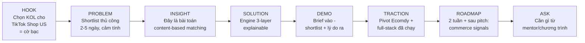
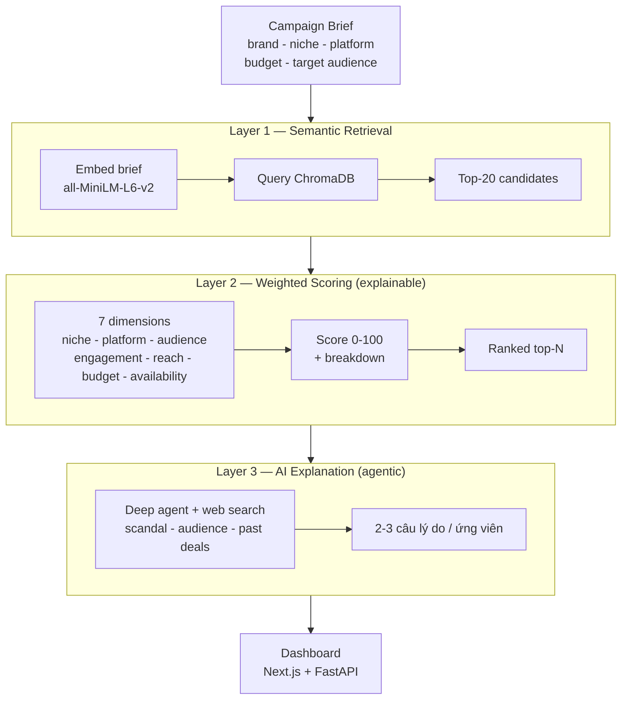
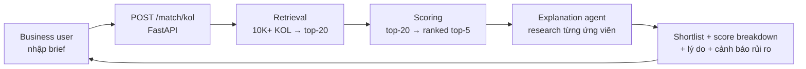
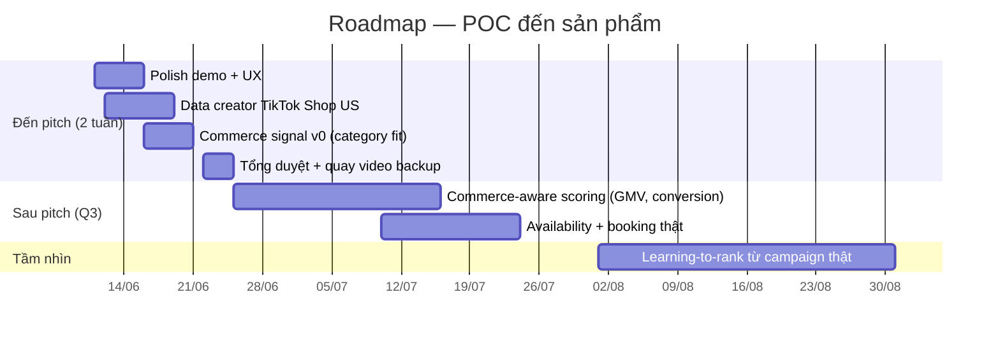
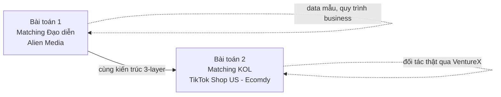

# Pitch Deck Plan — AI Matching Engine (Pennyworth × Ecomdy)

> **Mục tiêu tài liệu:** Kế hoạch chi tiết từng slide cho buổi pitch VentureX 2026. Đây là *living doc* — team review, chỉnh trước khi build slide thật.
> **Audience:** Mentor / Ban giám khảo VentureX
> **Narrative:** Problem → Solution → Demo → Roadmap (cân bằng)
> **Thời lượng đề xuất:** 7 phút trình bày + 3–5 phút Q&A
> **Deadline pitch:** ~2 tuần kể từ 11/06/2026
> **Trạng thái:** Draft v1 — chờ team align

---

## 0. Bối cảnh & quyết định chiến lược trước khi làm slide

Ba điều cả team phải thống nhất trước, vì nó định hình toàn bộ deck:

1. **Pivot Director → KOL là tài sản, không phải điểm yếu.** Team khởi đầu với bài toán matching đạo diễn cho Alien Media (data mẫu, quy trình business). Sau khi vào VentureX và match được với **Ecomdy**, team chuyển sang bài toán thật mà đối tác (a Linh) cần: **matching KOL cho TikTok Shop US**. Cùng một kiến trúc lõi 3-layer được tái sử dụng gần như nguyên vẹn — đây chính là bằng chứng kiến trúc đủ tổng quát và team adapt nhanh. Kể câu chuyện này như một **proof of velocity & architecture generality**.

2. **Có 3 điểm lệch giữa code hiện tại và bài toán TikTok Shop US — đưa vào roadmap, không giấu:**
   - **Data:** hiện là 53 KOL *Việt Nam* (fee theo VND, bio tiếng Việt). Chưa phải creator TikTok Shop US.
   - **Scoring tối ưu sai mục tiêu:** 7 chiều hiện tại đo *brand awareness* (reach, engagement). TikTok Shop là **commerce** — cần tín hiệu chuyển đổi: GMV, conversion/affiliate, lịch sử live-selling, product-category fit.
   - **Thiếu dữ liệu availability thật:** `_availability_score` đang hard-code `1.0`.

3. **Định vị sản phẩm:** không thay thế judgment con người, mà **nén bước shortlist từ 2–5 ngày xuống vài phút** + giải thích được lý do (explainable). Đây là thông điệp xuyên suốt.

---

## 1. Narrative arc — mạch kể 7 phút



Mỗi slide phục vụ đúng một bước trong mạch này. Không thêm slide thừa.

---

## 2. Slide-by-slide plan

> Quy ước: mỗi slide gồm **Thông điệp chính** (1 câu khán giả phải nhớ) · **Nội dung trên slide** (tối giản) · **Visual** · **Speaker notes** · **Thời lượng**.

### Slide 1 — Title / Hook
- **Thông điệp chính:** Chúng tôi biến việc chọn KOL từ cảm tính thành quyết định có dữ liệu.
- **Nội dung:** Tên sản phẩm + 1 dòng tagline. Ví dụ: *"AI Matching Engine — tìm đúng KOL cho mỗi campaign trong vài phút, kèm lý do."* Logo Pennyworth + badge "VentureX 2026 × Ecomdy".
- **Visual:** Full-bleed, 1 hình. Không bullet.
- **Speaker notes:** Mở bằng câu hook nhức nhối: *"Một thương hiệu muốn bán hàng trên TikTok Shop US. Họ có 10.000 creator để chọn. Hiện tại họ chọn bằng… cảm giác và vài cái tên quen. Đó là cờ bạc có ngân sách."*
- **Thời lượng:** 30s

### Slide 2 — Problem
- **Thông điệp chính:** Shortlist KOL thủ công chậm, cảm tính, không nhất quán — và trên TikTok Shop US thì sai một KOL là cháy ngân sách.
- **Nội dung:** 3 ý cô đọng (không phải đoạn văn):
  - Mất **2–5 ngày** để shortlist thủ công mỗi brief.
  - Phụ thuộc kinh nghiệm cá nhân → không scale, không nhất quán.
  - TikTok Shop US: hàng chục nghìn creator, tín hiệu phân mảnh (followers ≠ doanh số).
- **Visual:** Timeline "2–5 ngày" với icon người ngồi lọc spreadsheet.
- **Speaker notes:** Đây là pain Ecomdy/a Linh xác nhận là thật. Nhấn: vấn đề không phải thiếu KOL, mà là *thiếu cách chọn nhanh và giải thích được*.
- **Thời lượng:** 45s

### Slide 3 — Insight / Why us
- **Thông điệp chính:** Bản chất đây là bài toán *content-based matching* — và chúng tôi đã có lời giải đang chạy.
- **Nội dung:** Reframe: brief campaign ↔ profile creator là hai "tài liệu", việc matching là so khớp ngữ nghĩa + tín hiệu định lượng. Một câu về pivot: *"Chúng tôi đã chứng minh kiến trúc này trên bài toán matching đạo diễn, rồi tái dùng nó cho KOL chỉ trong vài ngày."*
- **Visual:** Sơ đồ brief ↔ candidate.
- **Speaker notes:** Đây là chỗ "cắm cờ" sự khác biệt: không phải một filter spreadsheet, mà là một matching engine có nền tảng kỹ thuật.
- **Thời lượng:** 30s

### Slide 4 — Solution overview (kiến trúc 3-layer)
- **Thông điệp chính:** Một engine 3 lớp: tìm nhanh → chấm điểm minh bạch → giải thích bằng AI agent.
- **Nội dung:** Sơ đồ kiến trúc (dùng mermaid mục 3.1). Mỗi layer 1 dòng lợi ích, không phải chi tiết kỹ thuật.
- **Visual:** Diagram 3-layer dọc, highlight "explainable" ở Layer 2 và "agentic web research" ở Layer 3.
- **Speaker notes:** Nhấn 3 điểm bán hàng: **nhanh** (Layer 1 semantic), **minh bạch** (Layer 2 score breakdown giải thích được từng điểm), **đáng tin** (Layer 3 agent tự search web check scandal/audience trước khi recommend).
- **Thời lượng:** 1 phút

### Slide 5 — How it works (deep-dive nhẹ, vẫn dễ hiểu)
- **Thông điệp chính:** Mỗi lớp giải một bài con, ghép lại thành quyết định nhanh và bảo vệ được.
- **Nội dung:**
  - **Layer 1 — Semantic Retrieval:** brief → embedding → ChromaDB → top-20. *Vì sao:* lọc 10K xuống 20 trong mili-giây.
  - **Layer 2 — Weighted Scoring:** 7 chiều (niche, platform, audience, engagement, reach, budget, availability) → điểm 0–100 + breakdown. *Vì sao:* rule-based nên giải thích được từng điểm, không cần training data.
  - **Layer 3 — AI Explanation:** agent (deepagents) tự search web nghiên cứu KOL → viết 2–3 câu lý do. *Vì sao:* biến con số thành lý do business hiểu được, và bắt được rủi ro (scandal) mà số liệu không thấy.
- **Visual:** Sơ đồ luồng matching (mermaid 3.2).
- **Speaker notes:** Đây là slide gây ấn tượng kỹ thuật với mentor mà không sa đà. Nói rõ: Layer 3 *agentic* — nó không chỉ gọi LLM, nó *chủ động đi tìm bằng chứng*.
- **Thời lượng:** 1 phút

### Slide 6 — DEMO (trái tim của pitch)
- **Thông điệp chính:** Nhập 1 brief → vài giây sau có shortlist xếp hạng + điểm từng chiều + lý do.
- **Nội dung:** Demo trực tiếp (ưu tiên) hoặc video quay sẵn 60–90s fallback. Kịch bản ở mục 5.
- **Visual:** Màn hình thật: form brief → loading → card trượt với score breakdown + explanation.
- **Speaker notes:** Im lặng để sản phẩm tự nói. Chỉ thuyết minh đúng 3 thứ: input, tốc độ, và "nhìn này — nó giải thích *tại sao*".
- **Thời lượng:** 1.5 phút

### Slide 7 — Traction & team velocity
- **Thông điệp chính:** Chỉ trong ~6 tuần, team dev đã có full-stack chạy được + pivot thành công sang bài toán đối tác thật.
- **Nội dung:**
  - Pivot: Director (Alien Media) → KOL (Ecomdy/TikTok Shop US) — cùng kiến trúc.
  - Đã có: backend 3-layer end-to-end, frontend Next.js đầy đủ (engine + dashboard analytics), 53 KOL ingested, multi-provider LLM fallback (Google/xAI/OpenAI).
  - Đối tác: match với Ecomdy qua VentureX → bài toán có khách hàng thật, không phải giả định.
- **Visual:** Ảnh chụp dashboard + mini-timeline pivot.
- **Speaker notes:** Đây là chỗ chứng minh "team này *làm được*". Velocity + có đối tác = giảm rủi ro thực thi trong mắt mentor.
- **Thời lượng:** 45s

### Slide 8 — Roadmap (xử lý gaps một cách chủ động)
- **Thông điệp chính:** Chúng tôi biết chính xác cần làm gì tiếp — và đó là việc nâng từ "matching theo nội dung" lên "matching theo doanh số".
- **Nội dung:** Dùng timeline mermaid (3.3). 3 việc lớn:
  - **2 tuần tới (trước/đến pitch):** polish demo, thay data sang creator TikTok Shop US (kể cả mẫu nhỏ thật), thêm 1–2 commerce signal đơn giản (vd. category fit).
  - **Sau pitch — Q3:** bổ sung **commerce-aware scoring** (GMV, conversion/affiliate, live-selling history), availability thật.
  - **Tầm nhìn:** learning-to-rank từ kết quả campaign thật → engine tự cải thiện.
- **Visual:** Gantt mermaid.
- **Speaker notes:** Trình bày 3 gap (data US, commerce signals, availability) *như roadmap đã có kế hoạch* — thể hiện team hiểu sâu bài toán chứ không phải chưa thấy.
- **Thời lượng:** 45s

### Slide 9 — Ask / Close
- **Thông điệp chính:** Đây là điều chúng tôi cần từ chương trình để biến POC thành sản phẩm bán được.
- **Nội dung:** 2–3 ask cụ thể: kết nối data/creator TikTok Shop US thật, mentor về commerce/affiliate marketing, pilot với một brand qua Ecomdy. Kết bằng 1 dòng tầm nhìn.
- **Visual:** Tối giản, 1 câu tagline lặp lại slide 1 để đóng vòng.
- **Speaker notes:** Ask phải cụ thể và khả thi. Đóng lại bằng hook ban đầu: *"Chọn KOL không cần là cờ bạc nữa."*
- **Thời lượng:** 30s

---

## 3. Sơ đồ (mermaid) dùng trong deck

### 3.1 Kiến trúc 3-layer (Slide 4)



### 3.2 Luồng matching end-to-end (Slide 5)



### 3.3 Roadmap 2 tuần + sau pitch (Slide 8)



### 3.4 Câu chuyện pivot (Slide 7 — tùy chọn)



---

## 4. Đề xuất phương pháp matching SOTA (kèm theo, balance usability ↔ innovation ↔ simplicity)

> Theo định hướng dự án: ưu tiên phương pháp tối ưu, cân bằng dễ dùng — đổi mới — dễ triển khai. Dưới đây là lộ trình nâng cấp từ hiện trạng, xếp theo "đáng làm trước".

**Hiện trạng (đang chạy, giữ làm nền):**
Bi-encoder embedding (`all-MiniLM-L6-v2`) + ChromaDB cho retrieval, rule-based weighted scoring cho ranking, LLM-agent cho explanation. Đây là kiến trúc *retrieve → rank → explain* kinh điển, hoàn toàn hợp lý cho POC.

**Nâng cấp ưu tiên cao (rẻ, tác động lớn, ít rủi ro):**

1. **Hybrid retrieval (dense + sparse).** Kết hợp embedding với BM25/keyword, rồi **Reciprocal Rank Fusion**. Lý do: brief thường chứa từ khóa cứng (tên niche, tên platform, tên sản phẩm) mà embedding dễ bỏ sót. Triển khai đơn giản, gần như luôn cải thiện recall.

2. **Cross-encoder reranker ở Layer 1.5.** Sau khi lấy top-20 bằng bi-encoder, rerank bằng cross-encoder (vd. `bge-reranker` / `ms-marco-MiniLM`). Cross-encoder đọc *cặp* (brief, profile) cùng lúc nên chính xác hơn hẳn; chạy trên 20 ứng viên nên vẫn nhanh. Đây là "đòn bẩy chất lượng/chi phí" tốt nhất hiện nay cho matching.

3. **Embedding model mạnh hơn, đa ngôn ngữ.** `all-MiniLM-L6-v2` cũ và yếu tiếng Việt. Cân nhắc `bge-m3` hoặc `multilingual-e5` — quan trọng nếu data trộn Việt/Anh (creator US + brief có thể song ngữ).

**Nâng cấp đặc thù TikTok Shop (đổi mới có mục tiêu):**

4. **Commerce-aware scoring.** Bổ sung chiều đo doanh số vào Layer 2: GMV lịch sử, conversion/affiliate rate, số phiên live-selling, độ khớp product-category. Đổi trọng số từ *awareness* sang *bán hàng* — đây là điểm khác biệt thật giữa "tìm KOL nổi tiếng" và "tìm KOL bán được hàng".

5. **Learning-to-rank (giai đoạn có data).** Khi đã có kết quả campaign thật (ai được chọn, campaign nào ra doanh số), thay/tăng cường rule-based bằng LambdaMART/XGBoost-ranker hoặc fine-tune reranker trên click/conversion data. Engine tự học từ outcome — đây là con đường dài hạn để vượt đối thủ.

6. **Audience overlap / brand-safety embeddings.** Vector hóa *audience* của KOL (không chỉ metadata) để đo độ trùng với target của brand; kết hợp Layer 3 agent đã có để check brand-safety/scandal thành một điểm rủi ro định lượng.

**Nguyên tắc xuyên suốt:** giữ explainability. Mỗi nâng cấp phải vẫn trả được "vì sao ứng viên này" — vì đó là giá trị bán hàng cốt lõi với business user, và là thứ phân biệt với "hộp đen".

> Chi tiết kỹ thuật từng mục nên tách thành doc riêng (`docs/SOTA_MATCHING.md`) + flowchart mermaid khi team quyết định ưu tiên — tránh làm nặng pitch.

---

## 5. Kịch bản demo (Slide 6)

**Chuẩn bị (giảm rủi ro):**
- Quay sẵn video 60–90s làm fallback nếu live demo lỗi/mạng chậm.
- Pre-warm backend (ChromaDB + model load) trước khi lên sân khấu.
- Chuẩn bị sẵn 1 brief "đẹp" đã test cho kết quả thuyết phục.

**Kịch bản 90 giây:**
1. (10s) "Đây là góc nhìn của một brand muốn chạy TikTok Shop US." Mở form.
2. (15s) Nhập brief mẫu: brand + niche (vd. Beauty) + platform TikTok + target 18–24 + ngân sách + 1 câu mô tả.
3. (10s) Bấm match → để loading chạy, nói: "Sau lưng nó đang lọc hàng nghìn creator xuống top ứng viên."
4. (30s) Kết quả: lướt card trượt. Chỉ vào **score breakdown** — "đây, từng điểm đều giải thích được" — và **explanation** — "và đây là lý do, do AI tự research."
5. (15s) Chốt: "Việc này trước đây mất vài ngày. Vừa rồi mất vài giây, và quan trọng hơn — nó *bảo vệ được quyết định*."

---

## 6. Chuẩn bị Q&A (câu hỏi mentor hay hỏi)

- **"Data của các bạn có thật không?"** → Thành thật: hiện là mockup + creator VN để chứng minh engine; bước tiếp theo là data TikTok Shop US thật qua Ecomdy (đã trong roadmap). Nhấn engine không phụ thuộc nguồn data cụ thể.
- **"Followers cao đâu có nghĩa bán được hàng?"** → Đồng ý — đó *chính xác* là lý do roadmap có commerce-aware scoring (GMV, conversion). Hiện POC đo awareness; hướng đi là đo doanh số.
- **"Khác gì so với agency/tool đang có?"** → Tốc độ + explainability + agent tự kiểm rủi ro (scandal). Không phải black-box, business user hiểu và tin được.
- **"Vì sao rule-based mà không phải ML?"** → POC chưa có ground truth; rule-based minh bạch, dễ tune, deterministic. Khi có data outcome sẽ chuyển sang learning-to-rank (đã có lộ trình).
- **"Mô hình kinh doanh?"** → (Cần team chốt — gợi ý: phí theo seat cho agency/brand, hoặc rev-share theo campaign qua Ecomdy.) *→ điểm cần align thêm, xem mục 7.*
- **"Vì sao pivot từ đạo diễn sang KOL?"** → Theo nhu cầu đối tác thật (Ecomdy/a Linh) qua VentureX. Cùng kiến trúc → adapt vài ngày → bằng chứng product đủ tổng quát.

---

## 7. Điểm cần team align thêm (hỏi tiếp trong quá trình build slide)

Mình cần thêm input ở các điểm sau để hoàn thiện deck — sẽ hỏi bạn từng phần:

1. **Mô hình kinh doanh** cho slide Ask/Close — chưa có trong repo. Phí seat? Rev-share qua Ecomdy? Freemium?
2. **Có số liệu traction định lượng nào không** (vd. thời gian match thực đo được, số brief đã test, feedback từ a Linh) để slide 7 mạnh hơn.
3. **Demo:** live hay video? Backend đã deploy (Railway/Vercel) hay chạy local khi pitch?
4. **Branding:** tên sản phẩm chính thức để pitch (Pennyworth? hay tên khác cho engine?) + có sẵn logo/template slide chưa.
5. **Người trình bày & phân vai** trên sân khấu (ai nói phần nào, ai chạy demo).

---

## 8. Checklist sản xuất deck

- [ ] Team align mục 0 (định vị pivot) + mục 7 (business model, traction, demo mode)
- [ ] Chốt tên sản phẩm + template slide
- [ ] Dựng 9 slide theo mục 2
- [ ] Render 4 sơ đồ mermaid thành ảnh chèn slide (hoặc giữ mermaid nếu công cụ hỗ trợ)
- [ ] Chuẩn bị brief demo + quay video fallback
- [ ] Pre-warm + test demo 3 lần liên tiếp không lỗi
- [ ] Tổng duyệt bấm giờ ≤ 7 phút
- [ ] Chuẩn bị câu trả lời mục 6
```
